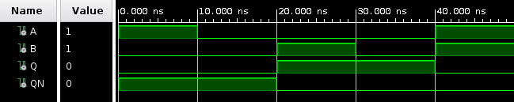

Assignment 3: Vivado Tutorial with Simulation and Synthesis
-----------------------------------------------------------

## Task 2

1. 1338 FFs are used out of 82000 available.
2. 1657 LUTs are used out of 41000 available.
3. A LUT is a Look Up Table, it's basically a cell that determines from the given inputs what are the outputs. The core of FPGAs are indeed LUTs, as they can be programmed to implement any logical gate or function.
4. The total on-chip power in the project is 0.41 W, it represents the power dissipated by the chip coming from any source.
5. 
	* Simulation: shows the waveform of the signals when stimulated according to the given testbench.
	* Synthesis: Can check how the code has been mapped to circuits and what are the physical requirements of it (e.g. number of LUTs and nets).
	* Implementation: Can check how the design has been actually placed on the device and whether it violates external constraints (e.g. timing or power).

## Task 3

The VHDL description and the testbench are attached to the task submission.
