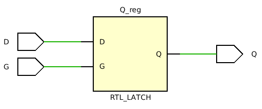
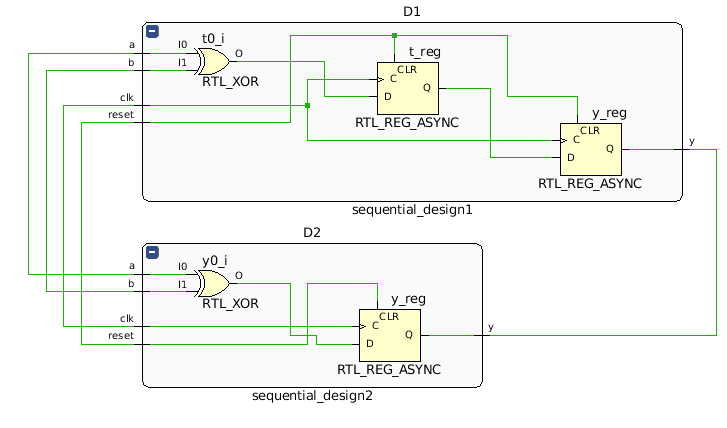

Assignment 4: Common VHDL pitfalls and misconceptions
-----------------------------------------------------

## Task 1

```vhdl
entity latch is
    Port ( D : in STD_LOGIC;
           G : in STD_LOGIC;
           Q : out STD_LOGIC);
end latch;

architecture Behavioral of latch is
begin
    process(G, D) is
    begin
    if G = '1' then
        Q <= D;
    end if;
end process;
```

  
*RTL representation of the described latch*

It can happen, while writing a combinatorial process, to leave some signals unassigned in some cases. That's when latches are inferred: as the value of those signals is not set, the previous one must be used and that requires a memory. Latches are indeed memory units like flip-flops but not clocked (suitable in combinatorial parts).
As it can be seen from the previous code, Q is just assigned when G is 1, otherwise it's old value is used (implicitly).

It is indeed necessary to assign all signals in every case in combinatorial processes (to avoid latches), this can be long, especially in finite state machines implemented with `case` statements and using default values most of the times. A good way to ensure not to infer latches in this case can be to define default values for all the signals just before the `case` statement, so that whatever is not modified during the process is still assigned a value.

## Task 2

In design2, the variable `t` is assigned and its value immediately used, in this case the two statements are equivalent to `y <= a xor b`, hence there's no need to implement `t` as a flip-flop. Instead design1 is using the old value of `t` before assigning a new one, hence memory is needed.



As shown in the picture, the design 1 has one more flip-flop linked to the xor gate to delay the value by one clock cycle, `y` is normally represented as flip-flop to give a clocked value as output.

The synthesiser will determine whether to use registers or not based on the description: if a memory is required in order to hold the value and the process is synchronous, then a register will be used. In the example indeed the value of `t` needs to be kept for one clock cycle and also `y` needs to be driven at every clock cycle.

It's possible to write to the same signal (or variable, just if shared) from multiple processes, but since all of them are running concurrently, it can happen that more values are written in the same signal. This can lead to an error (multiple drivers for net) unless a resolution function is specified for the signal. If that's the case, the resolution function will choose from all the values, what will be the actual one driving the signal. However it's typically not ideal to have multiple drivers as some behaviours that are fine during simulation, may not be physically reproducible and give unexpected errors after synthesis.  
Reading signals from multiple processes is instead perfectly fine.

## Task 3

According to [1], there should not be any mismatch between pre-synthesis and post-synthesis simulation in order to infer a synthesizable model. In the description of the figure, the post-synthesis simulation will simulate a 2-input *and* gate, while in the pre-synthesis simulation, the process will be executed only when there are changes in the signal *a*, not considering any change on *b* which does not coincide with a change in *a*. This functionality will not match that of the 2-input *and* gate of the post-synthesis model. In consequence, the description will not be synthesizable.

When there are mistmatches as the one described earlier, most of the synthesis tools will not produce any synthesis at all, and if they do, the logic will most likely be erroneous, producing wrong values at the output ports, and therfore violating the described behavior.

In general, there are good practices to avoid the description to cause such mismatches. Among these practices, using complete sensitivity lists for the description of combinational logic would ensure conformance between the synthesized circuit and simulation results. More good practices can be found in [1] and alternative methods are described in [2].

## Task 4

A scenario would be the following:

```vhdl
    process(a) is
    begin
        b <= a xor b;
        y <= b;
    end process;
```

This process is executed only upon a change on the signal *a*, if after the evaluation of such a change, the signal *b* changes, this last change will not trigger the execution of the process again. This way, the bahavioral model will not oscilate.

The use of the same signal/variable on both sides of the assignment is quite common and appropiate within the description of register in a sequential logic. In this type of circuits, the execution of the process is triggered just a by a clk signal or some async. signal, being unaltered upon changes of other signals. 

## References

* [1] Mills, D., & Cummings, C. E. (1999, March). RTL coding styles that yield simulation and synthesis mismatches. In SNUG (Synopsys Users Group) 1999 Proceedings.

* [2] Molenkamp, E., & Mekenkamp, G. E. (1997, October). Processes with'incomplete'sensitivity lists and their synthesis aspects. In Proceedings VHDL International Users' Forum. Fall Conference (pp. 75-81). IEEE. 