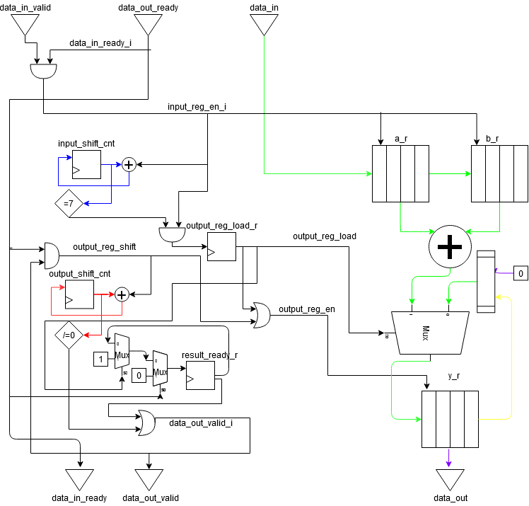
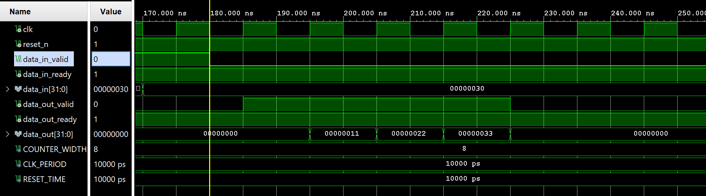

Assignment 5: Datapath Design
-----------------------------------------------------

## Task 1

In Figure 1. the microarchitecture of the Datapath and the control unit is shown.

  
*Figure 1. Microarchitecture of Mega Adder*

In the diagram there are different bit sizes for the wires, the detail is shown in Table 1.

| Color  | Size  |
|---|---|
| Black  | 1  |
| Red  | 2  |
| Blue  | 3  |
| Purple  | 32  |
| Yellow  | 96  |
| Green  | 128  |

*Table 1. Bit Size of wires*

## Task 2

In Figure 2., it can be seen that the input values for a and b are:

    a: x00000000_00000010_00000020_00000030
    b: x00000000_00000001_00000002_00000003

From Figure 3., it is seen that the output value of y is:

    y: x00000000_00000011_00000022_00000033

This value is clearly correct and the Figure 2 and Figure 3, it is also shown that the valid/ready handshake was carried correctly.

  
*Figure 2. Waveform of Input values for MegaAdder*

  
*Figure 3. Waveform of output values for MegaAdder*

## Task 3

In the Design (Datapath and Control Unit) 391 FFs were identified, and the detailed count is listed in Table 2.

| Signal  | Number of FFs  |
|---|---|
| input_shift_cnt  | 3  |
| output_shift_cnt  | 2  |
| result_ready_r  | 1  |
| output_reg_load_r  | 1  |
| a_r  | 128  |
| b_r  | 128  |
| y_r  | 128  |

*Table 2. Detailed Count of Number of FFs*

The result obtained after running the synthesis tool is found in Figure 4. Based on this results, it can be concluded that the number of FFs calculated are correct.

  
*Figure 4. Post-Synthesis Results*

## Task 4

The timing contraints were changed, and a clock period of 10ns was set, which implies setting a target frequency of 100MHz. After running the synthesis tool again, the timing report indicates that the timing constraints were met. The Timing report is shown in Figure 5.

  
*Figure 5. Timing Report of MegaAdder after changes*

## Task 5

According to the timing report the critical path is located on input of the register *y_r* and the details are shown in Figure 6. After analyzing the signal at the input of this register *y_nxt*, a change on the microarchitecture is proposed as it is indicated in Figure 7.

  
*Figure 6. Timing details of the critical path*

  
*Figure 7. Proposed new microarchitecture*